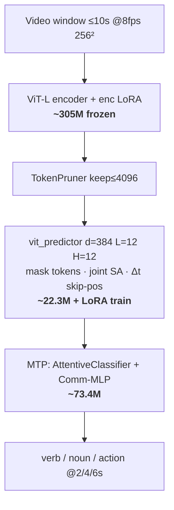
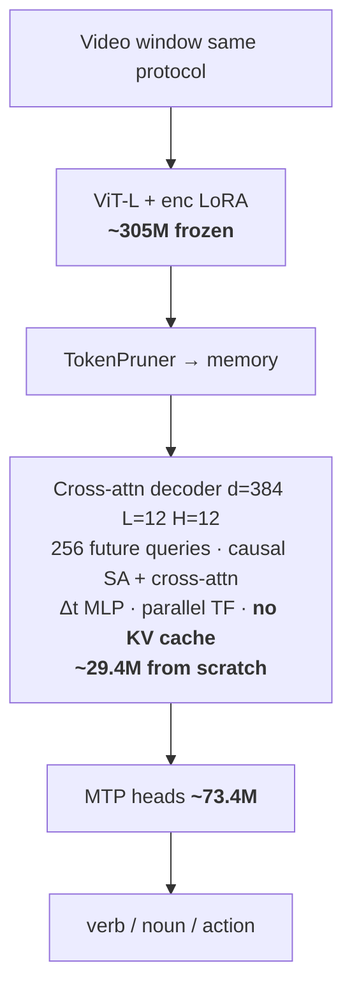
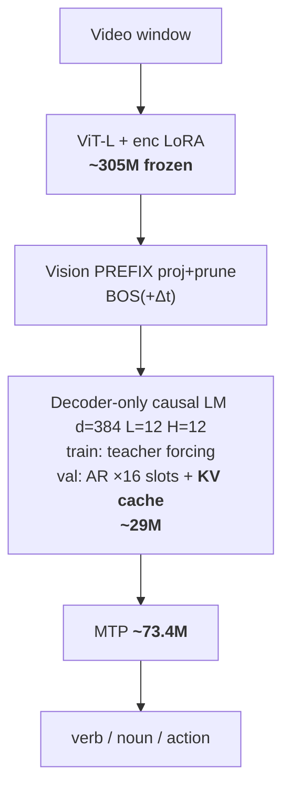
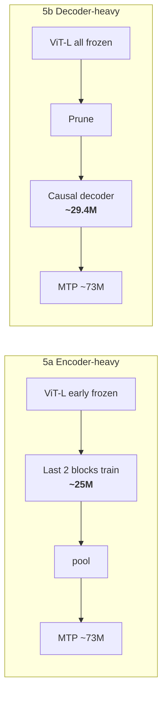
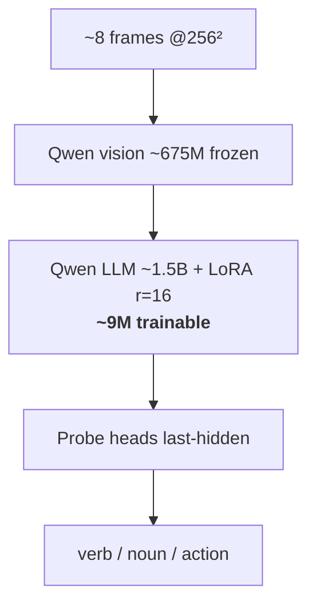

# Jepa_baseline

Baselines and capacity-matched comparisons for **HD-EPIC P01 Streaming Video**
action anticipation (**+2 / +4 / +6 s**).

This tree lives on branch **`baseline`** of
[Nemo0412/JEPA_ARVR](https://github.com/Nemo0412/JEPA_ARVR) under `baselines/`.
V-JEPA training code remains in the main repo (`app/hdepic_lora_action_anticipation/`).

## Protocol (shared)

- Annotations: `/scratch/.../hdepic_vjepa_annotations/stream_half_split/`
- Half-split per video; context grow 4→10s; tick 2s; predict **+2/+4/+6s**
- Primary metric: **action Top-1 / Top-5 @ +2s**
- Each tick is a **finite window sample** (≤10s), not one infinite AR decode over the whole video.

---

## Architectures (experiments we are running)

All JEPA-aligned arms share the same **stream CSV / MTP heads / +2+4+6 loss**, unless noted.
Long context is handled by **sliding window + token prune / frame subsample**, not by KV cache
(KV cache only speeds **step-by-step token generation**).

```text
                    ┌─────────────────────────────────────┐
   MP4 window       │  SHARED PROTOCOL                    │
   (≤10s @ 8fps) ──►│  half-split · tick 2s · MTP 2/4/6s  │
                    └─────────────────────────────────────┘
                                      │
          ┌───────────────────────────┼───────────────────────────┐
          ▼                           ▼                           ▼
   [1] V-JEPA vanilla         [2] Exp A / scratch /          [3] Full Qwen2-VL
       anticipative               allocation / qwen-style         2B probe
       predictor                  (ViT-L frozen variants)
```

### Comparison matrix

| # | Experiment | Vision | Future / temporal module | Long-context | KV cache | Trainable focus | Out dir |
|---|------------|--------|--------------------------|--------------|----------|-----------------|---------|
| 1 | **V-JEPA vanilla** | Frozen ViT-L + frozen enc LoRA | Pretrained **`vit_predictor`** (mask tokens, joint SA) + pred LoRA | **TokenPruner keep≤4096** | No | pred LoRA + MTP | `p01_stream_mtp_2_4_6` |
| 2 | **Exp A causal decoder** | Same as (1) | **Cross-attn decoder**: causal queries ⊕ memory (parallel TF) | Same prune ≤4096 | No | ~29M decoder + MTP | `p01_stream_causal_decoder_2_4_6` |
| 3 | **Scratch predictor** | Same as (1) | Same `vit_predictor` arch as (1), **weights re-init**, full train, no pred LoRA | Same prune | No | full predictor + MTP | `p01_stream_scratch_predictor_2_4_6` |
| 4 | **Qwen-style on ViT-L** | Same as (1) | **Decoder-only** LM: vision = prefix; train TF; **val AR** | prune / `max_prefix` | **Yes on val AR** | ~29M decoder + MTP | `p01_stream_qwen_style_decoder_2_4_6` |
| 5a | **Encoder-heavy** | Pretrained ViT-L, **last 2 blocks** trainable | **None** (pool encoder tokens) | prune ≤4096 | No | ~25M enc blocks + MTP | `p01_stream_encoder_heavy_2_4_6` |
| 5b | **Decoder-heavy** | Frozen ViT-L (**no** enc LoRA) | Same cross-attn decoder as Exp A | prune ≤4096 | No | ~29M decoder + MTP | `p01_stream_decoder_heavy_2_4_6` |
| 6 | **Qwen2-VL-2B probe** | Qwen ViT (~675M) | Qwen **LLM decoder** (~1.5B) + LoRA | **~8 frames** subsample | (HF gen path; probe uses full forward) | LoRA~9M + heads | `p01_stream_qwen2vl2b_2_4_6` |
| — | RU-LSTM / vit_tiny | (separate capacity baselines) | LSTM / tiny JEPA | feature / tiny tokens | — | ~18–20M | see Progress |

### Module graphs (params)

Boxes = modules · arrows = forward data · **bold** ≈ param count.

**[1] V-JEPA vanilla** — total ~401M · trainable ~89M · best @2s **25.88%**



**[2] Exp A causal decoder** — trainable ~103M · best @2s **25.67%**



**[3] Scratch predictor** — same as [1] but predictor **re-init + fully trained** (~22.3M), no pred LoRA.

**[4] Qwen-style on ViT-L** — decoder-only + **KV cache on val AR**



**[5] Param allocation** (~25–30M core, no enc LoRA)



**[6] Qwen2-VL-2B** — total ~2.22B · trainable ~8.8M · best ~20.9%



### What each experiment answers

| Experiment | Claim it supports / tests |
|------------|---------------------------|
| Vanilla vs Exp A | Same encoder: anticipative JEPA predictor vs parallel causal decoder |
| Scratch predictor vs Exp A | Architecture vs **predictor pretrain** |
| Qwen-style on ViT-L | Qwen **decode pattern** (decoder-only + KV AR) with JEPA vision |
| Encoder- vs decoder-heavy | **Where** ~30M capacity sits (vision blocks vs decoder) |
| Full Qwen2-VL-2B | Smallest official VL decoder stack on same protocol (not param-matched) |

### KV cache vs pruning (short)

- **Prune / subsample / 10s window** → make the **video token sequence** affordable.
- **KV cache** → avoid recomputing K/V when **emitting many AR tokens** on a fixed prefix.
- Exp A & JEPA predictor: parallel future prediction → prune yes, KV cache no.
- Qwen-style (4): val uses KV cache for 16 AR slots; still prunes the vision prefix.

---

## Layout

| Path | What |
|------|------|
| [`rulstm/`](rulstm/) | Upstream [RU-LSTM](https://github.com/fpv-iplab/rulstm) (vendor) |
| [`rulstm_hdepic/`](rulstm_hdepic/) | Streaming RU-LSTM on HD-EPIC P01 |
| [`jepa_tiny_18m/`](jepa_tiny_18m/) | From-scratch V-JEPA `vit_tiny` ≈18–20M vs RU-LSTM |
| [`qwen_vl_stream/`](qwen_vl_stream/) | Qwen2-VL-2B LoRA probe (official smallest Qwen-VL) |
| [`jepa_causal_decoder/`](jepa_causal_decoder/) | **Exp A:** causal decoder on frozen ViT-L latents (vs JEPA predictor); see README for predictor vs CA-decoder (KV-cache note) |
| [`jepa_qwen_style_decoder/`](jepa_qwen_style_decoder/) | **Qwen-style** decoder-only + KV-cache AR on frozen ViT-L (JEPA-aligned protocol) |
| [`jepa_scratch_predictor/`](jepa_scratch_predictor/) | From-scratch JEPA predictor control (vs Exp A) |
| [`param_allocation/`](param_allocation/) | Encoder-heavy vs decoder-heavy (~25–30M) allocation |
| [`vlesa/`](vlesa/) | Upstream [VLESA](https://github.com/HanjiangHu/VLESA) (vendor) |
| [`vlesa_latency/`](vlesa_latency/) | VLESA safety-filter GPU latency bench |

---

## Progress (2026-08-02)

### Status snapshot (cluster)

| Job / arm | State | Notes |
|-----------|-------|-------|
| V-JEPA vanilla | **done** | best action@2s Top-5 **25.88%** |
| Exp A causal decoder | queued (resume) | 4 epochs done; best **25.67%** @ep2; ep3 24.40% |
| Qwen2-VL-2B | queued (resume) | 3 epochs; best **20.95%** @ep0; ep2 dropped to 17.95% |
| Qwen-style on ViT-L | **RUNNING** | epoch-0 train ~late; decoder ~22.4M; no full val yet |
| Scratch predictor | queued | param_report: pred ~22.1M / train ~95.5M |
| Encoder-heavy | queued | last-2 blocks ~25.2M / train ~98.6M |
| Decoder-heavy | queued | decoder ~29.4M / train ~102.9M |

### 1) V-JEPA video-only vanilla (reference)

- Config: **ViT-L frozen** + stream MTP; **~401M total / ~89M trainable**
- Out: `/scratch/ll5914/experiments/p01_stream_mtp_2_4_6/`
- **Best (epoch 2): action@2s Top-5 ≈ 25.88%** (@4s 22.31 · @6s 19.77)

### 2) RU-LSTM streaming (original-size temporal ~18M)

- Out: `/scratch/ll5914/experiments/rulstm_hdepic_p01_stream/`
- Val **action@2s: 6.58 / 19.28** (Top-1 / Top-5)
- @4s: 5.34 / 16.40 · @6s: 4.69 / 15.04

### 3) V-JEPA `vit_tiny` ≈18–20M (from scratch, video-only)

- Params: encoder ~5.6M + predictor 320×10 ~12.5M + heads ~1.9M → **~19.9M**
- Out: `/scratch/ll5914/experiments/p01_stream_mtp_tiny18m_2_4_6/`
- **Reliable best (epoch 6, full val): action@2s 5.91 / 18.77**
- vs RU-LSTM @2s: **does not beat** main action (−0.67 / −0.51 pt)

### 4) Qwen-VL decoder baseline (full Qwen2-VL-2B)

- Official smallest Qwen-VL ~2B; LoRA probe on same stream protocol
- Out: `/scratch/ll5914/experiments/p01_stream_qwen2vl2b_2_4_6/`
- Epochs 0/1/2 action@2s Top-5: **20.95 / 20.80 / 17.95** (best = ep0; later overfit/drop)
- Still **~5×** JEPA total params — not param-matched

### 5) Exp A — causal decoder on JEPA latents

- Code: [`jepa_causal_decoder/`](jepa_causal_decoder/) · decoder ~29.4M from scratch
- Out: `/scratch/ll5914/experiments/p01_stream_causal_decoder_2_4_6/`
- Val action@2s Top-5 by epoch: 23.56 → 24.80 → **25.67** → 24.40
- **Best 25.67% @ep2** — within ~0.2 pt of JEPA vanilla (25.88%)

### 5b) From-scratch predictor (control for Exp A)

- Code: [`jepa_scratch_predictor/`](jepa_scratch_predictor/)
- Out: `/scratch/ll5914/experiments/p01_stream_scratch_predictor_2_4_6/`
- Queued; predictor ~22.1M fully trainable (no pred pretrain/LoRA)

### 5c) Encoder-heavy vs decoder-heavy allocation

- Code: [`param_allocation/`](param_allocation/)
- Encoder-heavy: last-2 ViT-L blocks ~25.2M · Decoder-heavy: causal decoder ~29.4M (no enc LoRA)
- Both queued (have `param_report.json`, no completed val epoch yet)

### 5d) Qwen-style decoder on ViT-L (KV-cache AR val)

- Code: [`jepa_qwen_style_decoder/`](jepa_qwen_style_decoder/)
- Out: `/scratch/ll5914/experiments/p01_stream_qwen_style_decoder_2_4_6/`
- **Running** epoch-0 train (teacher forcing); val will use AR + KV cache
- Decoder ~22.4M · 16 future slots

### 6) Other

- **VLESA** latency harness under `vlesa_latency/`
- Stronger JEPA (concat-CA / MTP variants) tracked in main `JEPA_ARVR` jobs

### Snapshot table (action @ +2s Top-5)

| Method | Params (approx) | Top-5 @2s | Status |
|--------|-----------------|----------:|--------|
| V-JEPA vanilla (ViT-L frozen) | 401M tot / 89M train | **25.88** | **done** |
| Exp A causal decoder | enc frozen + ~29M | **25.67** | best@ep2; resume queued |
| Qwen2-VL-2B LoRA probe | ~2.2B / ~9M train | **20.95** | best@ep0; ep2↓; queued |
| RU-LSTM stream | ~18M | 19.28 | done |
| V-JEPA vit_tiny | ~19.9M | 18.77 | best@ep6 |
| Qwen-style on ViT-L | enc frozen + ~22M | — | **running** (ep0 train) |
| Scratch JEPA predictor | enc frozen + ~22M pred | — | queued |
| Encoder-heavy (last-2) | ~25M enc | — | queued |
| Decoder-heavy (no enc LoRA) | ~29M decoder | — | queued |

**Early read:** Exp A ≈ JEPA vanilla ≫ full Qwen2-VL-2B on this protocol. Scratch / allocation / Qwen-style still needed to separate pretrain vs architecture vs param placement.

---

## Cluster quick start

```bash
sbatch baselines/rulstm_hdepic/submit_rulstm_p01_stream.slurm
sbatch baselines/jepa_tiny_18m/submit_stream_tiny_18m.slurm
sbatch baselines/qwen_vl_stream/submit_qwen_stream.slurm
sbatch baselines/jepa_causal_decoder/submit_causal_decoder_stream.slurm
sbatch baselines/jepa_qwen_style_decoder/submit_qwen_style_decoder.slurm
sbatch baselines/jepa_scratch_predictor/submit_scratch_predictor.slurm
sbatch baselines/param_allocation/submit_encoder_heavy.slurm
sbatch baselines/param_allocation/submit_decoder_heavy.slurm
```

Absolute paths in `.slurm` / scripts point at NYU Torch scratch; edit for other machines.

## GitHub notes

- Nested vendor `.git` dirs under `rulstm/` and `vlesa/` are **not** pushed
  (copied as plain trees). Prefer submodules later if needed.
- Checkpoints / experiment dumps are gitignored; results live on scratch.
